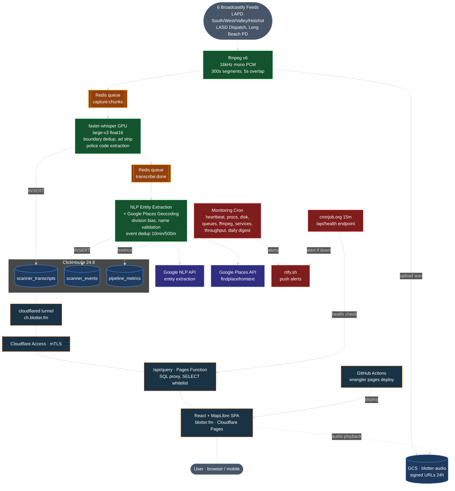

# Blotter

Real-time police scanner map for Los Angeles County. Live audio from Broadcastify is transcribed, locations are extracted and geocoded, and events are plotted on a map — all within minutes of the original dispatch.

**Live at [blotter.fm](https://blotter.fm)**

<a href="https://www.producthunt.com/products/blotter-3?embed=true&amp;utm_source=badge-featured&amp;utm_medium=badge&amp;utm_campaign=badge-blotter-3" target="_blank" rel="noopener noreferrer"></a>

## Architecture



## Stack

| Layer | Technology |
|-------|-----------|
| Audio capture | ffmpeg, 5-min WAV chunks, Google Cloud Storage |
| Transcription | faster-whisper large-v3 on CUDA GPU |
| NLP | Google Cloud Natural Language API |
| Geocoding | Google Places API with division biasing |
| Database | ClickHouse (H3 geospatial indexing) |
| Queues | Redis (in-memory, two-stage pipeline) |
| Frontend | React 19, MapLibre GL, Tailwind CSS |
| Hosting | Cloudflare Pages + Pages Functions |
| Tunnel | Cloudflare Tunnel + Access (mTLS) |
| Monitoring | Cron scripts, ntfy.sh push alerts, cronjob.org canary |
| GPU | RunPod spot instance (RTX 3090) |
| Process management | supervisord (redis, clickhouse, cloudflared, pipeline) |

## Project structure

```
backend/
  src/blotter/
    stages/
      capture.py            # ffmpeg stream capture, GCS upload
      stream_transcribe.py  # Whisper transcription with boundary dedup
      extract.py            # Ad stripping, location clause extraction
      extract_nlp.py        # Google NLP entity extraction
      extract_codes.py      # Police/10-code/penal code tagging
      geocode.py            # Google Places geocoding with division bias
      worker.py             # Process managers (capture, transcribe, process)
    config.py               # Pydantic settings (env-based)
    db.py                   # ClickHouse client
    gcs.py                  # GCS + local storage abstraction
    queue.py                # Redis queue helpers
    models.py               # Data models
    cli.py                  # Typer CLI entry points

frontend/
  src/
    components/
      Map.tsx               # MapLibre GL map, clustering, hit areas
      EventPanel.tsx        # Event detail with swipe-to-dismiss
      TranscriptPanel.tsx   # Transcript viewer with swipe-to-dismiss
      TranscriptPlayer.tsx  # Audio playback with synced segments
      TranscriptList.tsx    # Searchable transcript list
      SearchBox.tsx         # Natural language time range + search
      Tags.tsx              # Police code tag chips
      AboutModal.tsx        # About / support info
    lib/
      api.ts                # ClickHouse query layer
      parseTimeFilter.ts    # chrono-node time range parsing
      types.ts              # TypeScript interfaces
  functions/api/
    query.ts                # Pages Function: ClickHouse SQL proxy
    health.ts               # Pages Function: canary health check

infra/
  clickhouse/init.sql       # Schema (transcripts, events, metrics)
  cloudflared/config.yml    # Tunnel config (ch.blotter.fm)
  supervisord/
    supervisord.conf        # Process management (4 services)
  monitoring/
    crontab                 # All cron schedules
    heartbeat.sh            # Pipeline heartbeat (events + transcripts)
    check_procs.sh          # supervisord process health
    check_disk.sh           # Disk usage + orphan chunks
    check_queues.sh         # Redis queue depths (alert > 30)
    check_ffmpeg.sh         # Per-feed ffmpeg liveness
    check_services.sh       # Redis/ClickHouse ping
    check_resources.sh      # GPU/CPU/RAM metrics
    check_throughput.sh     # Hourly per-feed transcript/event counts
    daily_summary.sh        # Daily digest at 9am PT
  runpod/setup.sh           # Pod bootstrap script
  caddy/Caddyfile           # Reverse proxy (local dev)
  docker-compose.yml        # Local dev (ClickHouse + Redis + Caddy)
```

## Local development

```bash
# Start infrastructure
cd infra
docker compose up -d

# Backend
cd backend
uv sync
cp .env.example .env  # configure feeds, API keys
uv run blotter stream start

# Frontend
cd frontend
npm install
npm run dev
```

Requires: ffmpeg, Redis, ClickHouse, NVIDIA GPU with CUDA (for Whisper).

## Deployment

**Backend**: The RunPod pod boots from `infra/runpod/setup.sh`, which installs dependencies, starts supervisord (redis, clickhouse, cloudflared, pipeline), initializes the schema, and installs the monitoring crontab.

**Frontend**: Auto-deploys via GitHub Actions on push to `production` branch. Manual deploy with `npx wrangler pages deploy dist --branch production` from `frontend/`.
