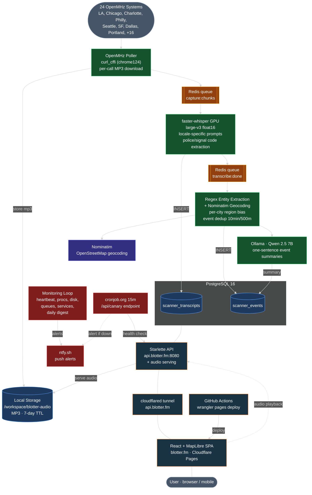

# Blotter

Real-time police scanner map covering 21 US metro areas. Per-call audio from OpenMHz is transcribed, locations are extracted and geocoded, and events are plotted on a map — all within seconds of the original dispatch.

**Live at [blotter.fm](https://blotter.fm)**

<a href="https://www.producthunt.com/products/blotter-3?embed=true&amp;utm_source=badge-featured&amp;utm_medium=badge&amp;utm_campaign=badge-blotter-3" target="_blank" rel="noopener noreferrer"></a>

## Architecture



## Stack

| Layer | Technology |
|-------|-----------|
| Audio capture | OpenMHz API via curl_cffi (Chrome 124 TLS), per-call MP3, local storage |
| Transcription | faster-whisper large-v3 on CUDA GPU, locale-specific prompts |
| NLP | Regex-based entity extraction (street addresses, intersections, street names) |
| Geocoding | Nominatim (OpenStreetMap) with per-city region biasing |
| Summarization | Ollama (Qwen 2.5 7B on GPU) |
| Database | PostgreSQL 16 (pg_trgm full-text, 7-day TTL) |
| Queues | Redis (in-memory, two-stage pipeline) |
| API | Starlette + uvicorn (REST, CORS, audio file serving) |
| Frontend | React 19, MapLibre GL, Tailwind CSS |
| Hosting | Cloudflare Pages (SPA) |
| Tunnel | Cloudflare Tunnel (token-based, api.blotter.fm) |
| Monitoring | supervisord monitoring loop, ntfy.sh push alerts, cronjob.org canary |
| GPU | RunPod (A5000 24GB VRAM) |
| Process management | supervisord (redis, postgres, ollama, cloudflared, api, pipeline, monitoring, pg-backup, pg-ttl) |

## Project structure

```
backend/
  src/blotter/
    stages/
      capture_openmhz.py    # OpenMHz per-call capture via curl_cffi
      stream_transcribe.py  # Whisper transcription with locale prompts
      extract.py            # Location clause extraction (regex)
      extract_nlp.py        # Regex entity extraction (addresses, streets, intersections)
      extract_codes.py      # Police/10-code/signal code tagging
      geocode.py            # Nominatim geocoding with per-city bias
      summarize.py          # Ollama event summarization
      embed.py              # Sentence-transformer embeddings
      worker.py             # Process managers (capture, transcribe, process)
      transcribe.py         # Whisper model wrapper
    config.py               # Pydantic settings (env-based)
    db.py                   # PostgreSQL client (psycopg)
    api.py                  # Starlette REST API + audio serving
    gcs.py                  # Local storage client
    queue.py                # Redis queue helpers
    models.py               # Data models
    cli.py                  # Typer CLI entry points

frontend/
  src/
    components/
      Map.tsx               # MapLibre GL map, clustering, hit areas
      EventPanel.tsx        # Event detail with swipe-to-dismiss
      TranscriptPanel.tsx   # Transcript viewer with swipe-to-dismiss
      TranscriptPlayer.tsx  # Audio playback with synced segments
      TranscriptList.tsx    # Searchable transcript list
      SearchBox.tsx         # Natural language time range + search
      Tags.tsx              # Police code tag chips
      AboutModal.tsx        # About / support info
    lib/
      api.ts                # REST API client
      parseTimeFilter.ts    # chrono-node time range parsing
      types.ts              # TypeScript interfaces

infra/
  postgres/
    init.sql                # Schema (transcripts, events, embeddings)
    pg_dump.sh              # Hourly dump to network volume
    pg_restore.sh           # Restore from dump on startup
  supervisord/
    supervisord.conf        # Process management (10 services)
  monitoring/
    monitoring_loop.sh      # Tick-based monitoring loop
    heartbeat.sh            # Pipeline heartbeat (events + transcripts)
    check_procs.sh          # supervisord process health
    check_disk.sh           # Disk usage + orphan chunks
    check_queues.sh         # Redis queue depths (alert if growing)
    check_services.sh       # Redis/API ping
    check_memory.sh         # Memory usage tracking
    daily_summary.sh        # Daily digest at 9am PT
  runpod/setup.sh           # Pod bootstrap script (auto-runs on restart)
  caddy/Caddyfile           # Reverse proxy (local dev)
  docker-compose.yml        # Local dev (PostgreSQL + Redis + Caddy)
```

## Local development

```bash
# Start infrastructure
cd infra
docker compose up -d

# Backend
cd backend
uv sync
cp .env.example .env  # configure feeds
uv run blotter stream start

# Frontend
cd frontend
npm install
npm run dev
```

Requires: ffmpeg, Redis, PostgreSQL, NVIDIA GPU with CUDA (for Whisper + Ollama).

## Deployment

**Backend**: The RunPod pod boots from `infra/runpod/setup.sh`, which installs dependencies, initializes PostgreSQL, starts supervisord (redis, postgres, ollama, cloudflared, api, pipeline, monitoring, pg-backup, pg-ttl), and restores data from the network volume backup. The script auto-runs on pod restart via RunPod dockerArgs.

**Frontend**: Auto-deploys via GitHub Actions on push to `production` branch. Manual deploy with `npx wrangler pages deploy dist --branch production` from `frontend/`.
